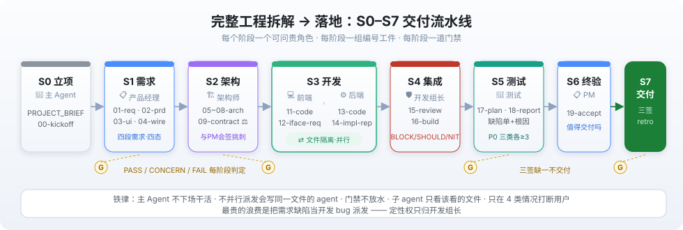
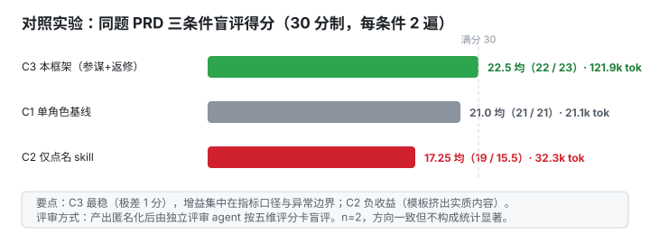
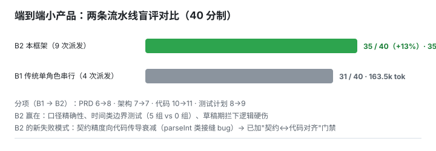

# Project Orchestrator · 面向 Agent 开发工具的多 Agent 协作编排协议

**一句话**：一套「项目负责人 + 6 单责角色 + 按需参谋 + 阶段门禁」的编排协议——主 Agent 不下场干活，只做派发、验收、放行；单写手、单层编排、只读参谋、门禁不放水。它不是某个工具的专属玩法，而是为任何具备子 agent 派发能力的 agent 开发工具设计的协作模式；**ZCode 与 OpenCode 是前两个先行实现**（本仓库先发布 ZCode 版）。交付以门禁验收为准，不承诺一次成型。

> 把需求说清楚、回答几个简短的追问，几小时后回来，一个完整的产品项目已经躺在电脑里：PRD、接口契约、可运行代码、测试报告，还有一间记录六个 agent 如何协作的作战室。当然，它比你亲自下场显著更慢——文末「诚实地说说优缺点」有一笔一笔的账。

> 🇬🇧 English: [README.en.md](README.en.md)

---

## 这是什么

不是提示词合集，是一份可安装的**编排协议**（1 份 skill + 6 份角色契约）。加载后主 Agent 像项目负责人一样工作：

- **只派发、只验收**：写代码、写文档、做决策全部派发给 6 个单责角色（产品经理/架构师/前端/后端/开发组长/测试），每个工件只有一个写手；
- **流程强制**：S0 立项 → S1 需求 → S2 架构（接口契约 = 前后端唯一法律）→ S3 开发（文件隔离可并行）→ S4 集成 → S5 测试 → S6 终验 → S7 交付（三签缺一不交付）；
- **每阶段一道门禁**：PASS / CONCERN / FAIL 判定，CONCERN 必须登记未决项；
- **两个进阶机制（实验数据支撑）**：**星形参谋**——只读参谋一轮挑刺，三条件对照实验中 PRD 盲评 21→22.5、端到端 +13%；**动态编制 L0–L2**——简单任务不加人，不把多智能体 15× token（研究任务实测）的成本烧在简单任务上。

协议与平台解耦：换一个宿主工具，换的是适配层，不是协议。ZCode 版已发布；OpenCode 版共享同一套契约模板与阶段定义，无需重写。

## 快速开始

```bash
# 1. 安装（ZCode，先行实现之一）
bash install.sh        # Windows PowerShell: .\install.ps1

# 2. 在 ZCode 会话里说任意一句唤醒语：
#    「启动主 Agent」/「接管项目」/「按 ORCHESTRATOR 继续」/「多 agent 协作开发」
# 3. 主 Agent 走唤醒流程：读 ORCHESTRATOR.md → 起看板 → 汇报当前阶段/谁在跑/下一步/待拍板项
# 4. 填 docs/PROJECT_BRIEF.md（产品输入书），放手让它跑
```

详细用法：**[docs/USAGE.md](docs/USAGE.md)**（docs 目前仅中文）

## 流水线与拓扑




每个阶段一个可问责角色、一组编号工件、一道门禁。架构详情：[docs/ARCHITECTURE.md](docs/ARCHITECTURE.md)。

## 站在谁的肩膀上

这套协议不是拍脑袋，是 2025–2026 多智能体研究的一次工程化收敛。每条都写清：核心发现 → 我们采纳了什么 / 在哪里持保留意见。

| 来源 | 核心发现 | 我们的取舍 |
|---|---|---|
| [Anthropic · How we built our multi-agent research system](https://www.anthropic.com/engineering/multi-agent-research-system) | 多智能体约 **15× token**（研究任务实测）；编码任务真正可并行的部分远低于研究任务 | 采纳：默认不并行，仅 S3 文件隔离的前后端并行；派发前先分诊（L0–L2） |
| [Anthropic · Agent Teams](https://code.claude.com/docs/en/agent-teams)（2026-02） | 3–5 teammates、禁嵌套、顺序/同文件工作回单会话 | 采纳：单层编排用契约 `tools` 白名单结构堵死，不靠提示词自觉 |
| [Cognition · Don't Build Multi-Agents](https://cognition.com/blog/dont-build-multi-agents) | 并行写手交换的是彼此看不见的**隐含决策**，合并即冲突 | 采纳：每个工件单写手。修正：不退回单线程——用门禁 + 只读参谋保留多视角（端到端 +13%） |
| [Cognition · Multi-Agents: What's Actually Working](https://cognition.com/blog/multi-agents-working)（2026-04） | 生产中真正有效的是**零共享上下文的干净评审 agent** | 采纳：参谋互不对话、不写工件、不担门禁——"只读参谋"正是此形态 |
| [LangChain · Benchmarking multi-agent architectures](https://www.langchain.com/blog/benchmarking-multi-agent-architectures) | supervisor 中继层是主要损失点，修复交接后 +50% | 采纳：只允许一层编排，主 Agent 中继时引用原文不改写 |
| [Google · Towards a Science of Scaling Agent Systems](https://arxiv.org/abs/2512.08296) | 顺序任务上多智能体全线 **−39~70%** | 采纳：架构契约阶段（S0–S2）绝不并行；分诊拿不准就降档 |
| [Dochkina · Drop the Hierarchy](https://arxiv.org/abs/2603.28990) | 预指派职级人设是负资产（自组织 +14%） | 采纳：参谋 prompt 只给"视角 + 挑战格式"，不写"首席/总监"剧本 |
| [等预算对照研究](https://arxiv.org/abs/2604.02460) | 不锁 token 预算的对照，测到的是算力不是架构 | 采纳：复现指南强制等预算。保留意见：本仓库端到端对照未等预算（2.2× 成本），故 +13% 仅作方向性证据 |
| [MAST 失败分类](https://arxiv.org/abs/2503.13657) | 7 个 SOTA 多智能体系统（含 MetaGPT/ChatDev 等 SDLC 框架）整体失败率 **41–86.7%** | 回应：承认本框架形似 SDLC 角色扮演，靠门禁判定、工件编号、契约↔代码对齐抽查与之切割 |

一句话总结这九条研究的公共结论：**多智能体的失败几乎都发生在"写"的环节**——所以这套协议把并行限制在文件隔离的 S3，把"写"之外的一切（评审、挑战、观察）都做成只读。

## 五条铁律

违反任何一条，整套协议失效：

1. 主 Agent 不下场干活——你一动手就没人验收了；
2. 不并行派发会写同一工件的 agent——读可并行，写/合并永不；
3. 门禁不放水——CONCERN 登记未决项，不用"差不多"换进度；
4. 每个子 agent 只看它该看的文件；
5. 只在四种情况打断用户，其余一律自行推进。

## 可视化看板：随项目实时生长的作战室

不开文件，浏览器里直接看多 agent 怎么协作——阶段、卡片、消息流、token 账本全程可见：


- **指挥台**：阶段 / 完成度 / 待处理指令，一键打开作战地图；
- **子 agent 卡片**：状态、进度、模型三口径、静默计时，中断同 id 续跑保留记忆；
- **协作消息流**：交付/进度实时置顶，工件点击即看；
- **Token 账本**：按角色消耗条形图，真实值读会话日志。


原理与排障：[docs/BOARD.md](docs/BOARD.md)（截图为演示数据）。

## 效果数据（摘要）

对照实验（同题 PRD，三条件 × 2 遍，独立评审盲评，30 分制）：



| 条件 | tokens/遍 | 得分 | 结论 |
|---|---|---|---|
| 单角色基线 | 21k | 21.0 | 简单任务的最优解 |
| 仅点名 skill | 32k | 17.25 | **负收益**（模板挤出实质内容） |
| 本协议（参谋+返修） | 122k | **22.5** | 增益集中在指标口径与边界维度 |

端到端小产品对照（盲评 40 分制）：本协议 **35/40** vs 单角色串行 **31/40**（+13%，成本 2.2×）：



完整数据与方法（含 n=2 的统计学局限声明）：[docs/EVIDENCE.md](docs/EVIDENCE.md)。

## 诚实地说说优缺点

**优点（有对照数据，方向性证据——n=2、非等预算，方向一致，待更大样本确认）**

1. **能独立落地整个产品**：讲清需求、经简单追问澄清后，从需求→PRD→契约→可运行代码→测试全链路工件一次交付到位（端到端验证对象为无后端单页应用）；
2. **产品质量高**：盲评对照 +13%；参谋在草稿期拦下监管级红线（如"无后端产品却写留存率北极星"）；
3. **过程可观察**：看板实时呈现阶段/卡片/消息流/token 账本，多 agent 交互不再是黑盒。

**代价（这是设计代价，不是 bug）**

1. **显著更慢**：多轮派发 + 门禁 + 返修，端到端时间显著长于单 agent 直接干；
2. **token 消耗大**：参谋组、返修轮、看板轮询都在烧 token，估算为单 agent 基线的数倍——**此条未经严格量化验证，待等预算对照实验确认**（现有 2.2× 数据为非等预算口径）。

**什么任务不该用它**：工作量不到一天的改动；决策链单一、切不开的任务；只想要补丁不想要工件链；token/时间预算紧到装不下返修轮。命中任一条，请用单角色直接干——分诊 L0 存在的意义就是把这条规则写进协议。

## 仓库结构

```
├── SKILL.md            # 协议本体（安装到 ~/.zcode/skills/project-orchestrator/）
├── agents/             # 6 份角色契约（安装到 ~/.zcode/agents/）
├── docs/
│   ├── BOARD.md          # 可视化看板（截图+运行原理）
│   ├── USAGE.md          # 详细使用（安装/唤醒/派发/看板/验收）
│   ├── ARCHITECTURE.md   # 架构构成与原理
│   ├── DESIGN.md         # 设计决策与依据（研究引用）
│   ├── EVIDENCE.md       # 实验数据：探针、demo、对照实验
│   ├── SECURITY.md / CREDITS.md / ROADMAP.md
│   └── assets/           # 架构图与看板截图
├── install.sh / install.ps1
├── DESCRIPTION.md        # GitHub 仓库描述
└── LICENSE
```

## Roadmap

> Changelog：v4.0（ZCode 版，前两个先行实现之一，本仓库）已发布。

- [ ] OpenCode 版（前两个先行实现之二，契约模板与阶段定义同源复用）
- [ ] 通用版（平台无关的协议描述 + 适配层）

详见 [docs/ROADMAP.md](docs/ROADMAP.md)。

## License 与隐私

MIT（见 [LICENSE](LICENSE)）；引用的第三方 skill 与研究见 [docs/CREDITS.md](docs/CREDITS.md)。本仓库经泄漏审计，规范见 [docs/SECURITY.md](docs/SECURITY.md)。
