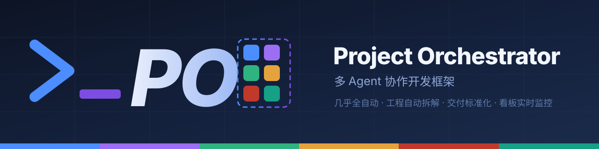
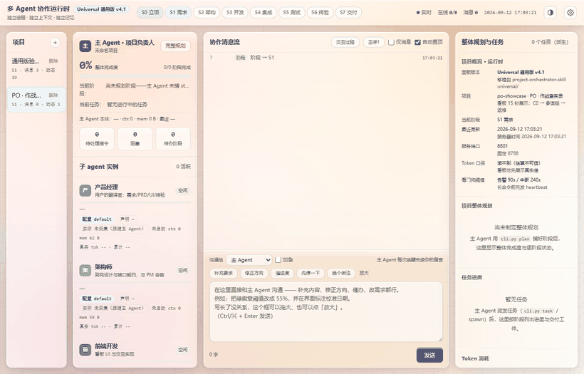
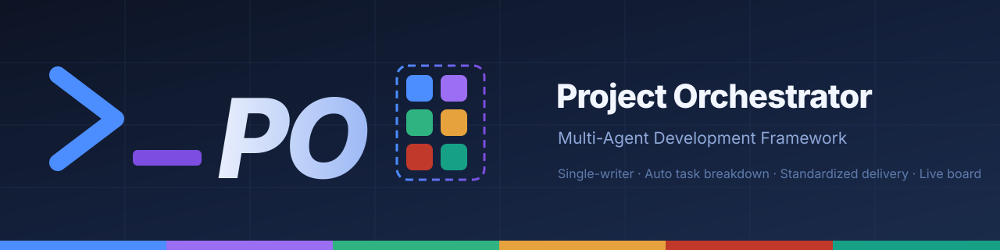
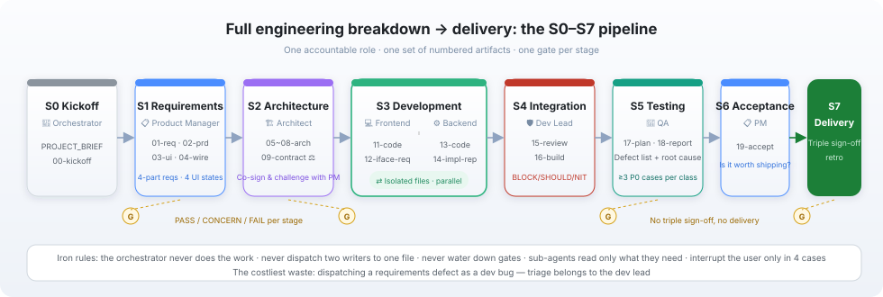
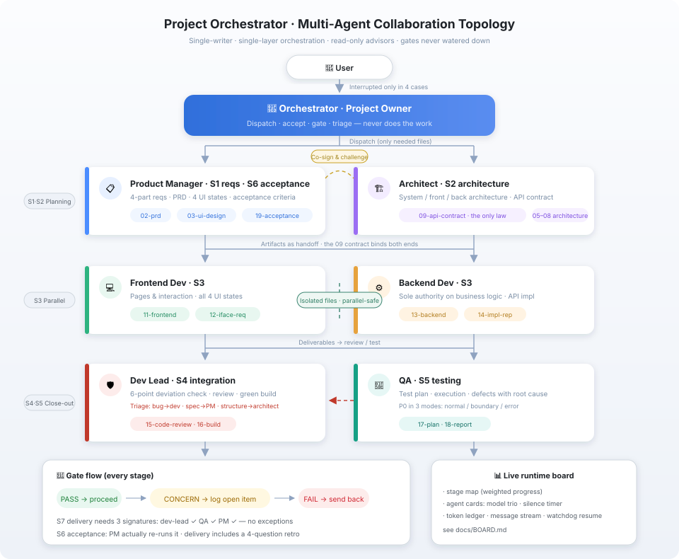

# Project Orchestrator · 多 Agent 协作开发框架

     

🌐 **双语 / Bilingual**：点击下方标题行原地展开对应语言（不跳转）· Click a summary below to expand that language in place.

---

<details open>
<summary><b>🇨🇳 简体中文</b>（点击折叠）</summary>






*实录：8801 看板上的真实运行——PM 草稿 → 双参谋并行挑刺 17 条 → 一轮返修 → 门禁 PASS。不是动画，是 API 时间线的逐帧截图。*

**一句话**：一套可安装的**多智能体交付框架**——「项目负责人 + 6 单责角色 + 按需参谋 + 阶段门禁」的编排协议，配 S0–S7 标准交付流程、实时可视化作战看板、全程可追溯的 token/事件账本。主 Agent 不下场干活，只做派发、验收、放行；单写手、单层编排、只读参谋、门禁不放水。它不绑定某个工具，而是面向任何具备子 agent 派发能力的 agent 开发工具；**已落地四个实现**：ZCode / OpenCode / WorkBuddy / 通用版 universal（差异对照见 docs/VERSIONS.md）。交付以门禁验收为准，不承诺一次成型。

> 把需求说清楚、回答几个简短的追问，几小时后回来，一个完整的产品项目已经躺在电脑里：PRD、接口契约、可运行代码、测试报告，还有一间记录六个 agent 如何协作的作战室。当然，它比你亲自下场显著更慢——文末「诚实地说说优缺点」有一笔一笔的账。


---

## 这是什么

不是提示词合集，是一份可安装的**协作开发框架**，四层各司其职：

| 层 | 内容 | 落点 |
|---|---|---|
| **协议** | 单写手、单层编排、只读参谋、门禁不放水——每条有 2025–2026 研究依据 | SKILL.md、docs/DESIGN.md |
| **流程** | 6 份角色契约 + S0–S7 阶段状态机 + 参谋会回路 + 变更分诊（C0–C2 / L0–L2） | agents/、docs/ARCHITECTURE.md |
| **可视化** | 实时作战看板：阶段进度、agent 卡片、协作消息流、作战地图 | runtime/（随 install 安装） |
| **追溯** | token 账本（真实值优先读会话库）、事件总线、门禁留痕、retro 四问 | runtime/lib/、.zcode/state/ |

框架加载后主 Agent 像项目负责人一样工作：

- **只派发、只验收**：写代码、写文档、做决策全部派发给 6 个单责角色（产品经理/架构师/前端/后端/开发组长/测试），每个工件只有一个写手；
- **流程强制**：S0 立项 → S1 需求 → S2 架构（接口契约 = 前后端唯一法律）→ S3 开发（文件隔离可并行）→ S4 集成 → S5 测试 → S6 终验 → S7 交付（三签缺一不交付）；
- **每阶段一道门禁**：PASS / CONCERN / FAIL 判定，CONCERN 必须登记未决项；
- **两个进阶机制（研究依据支撑）**：**星形参谋**——只读参谋一轮挑刺（Cognition 的 generator–verifier 形态）；**动态编制 L0–L2**——简单任务不加人，不把多智能体 15× token（研究任务实测）的成本烧在简单任务上。

框架与平台解耦：换一个宿主工具，换的是适配层，不是框架。

**版本家族**（一个协议，四个实现，差异对照见 [docs/VERSIONS.md](docs/VERSIONS.md)）：

| 实现 | 版本 | 一句话 |
|---|---|---|
| ZCode 版（本仓库根目录） | v4.1 | 协议最完整参考，开箱即装 |
| [universal/](universal/README.md) 通用版 | v4.1 | 平台无关母版：8 项原语映射 + A/B/C 三档适配 + 自举移植提示词 |
| [opencode/](opencode/README.md) OpenCode 版 | v4.1 | task 工具体系 + 5 个斜杠命令，14 条机制移植 |
| [workbuddy/](workbuddy/README.md) WorkBuddy 版 | v4.2 | 深度适配：原生 teams/tasks/台账优先，自建仅剩看板/门禁/契约 |

## 快速开始

```bash
# 1. 安装（ZCode 版，四个实现之一）
bash install.sh        # Windows PowerShell: .\install.ps1

# 2. 在 ZCode 会话里说任意一句唤醒语：
#    「启动主 Agent」/「接管项目」/「按 ORCHESTRATOR 继续」/「多 agent 协作开发」
# 3. 主 Agent 走唤醒流程：读 ORCHESTRATOR.md → 起看板 → 汇报当前阶段/谁在跑/下一步/待拍板项
# 4. 填 docs/PROJECT_BRIEF.md（产品输入书），放手让它跑
```

详细用法：**[docs/USAGE.md](docs/USAGE.md)** · 分平台安装：**[docs/INSTALL.md](docs/INSTALL.md)** · 四实现的包都在 [Releases](https://github.com/kimi0hhhh/project-orchestrator-skill/releases) 可直接下载

## 流水线与拓扑


每个阶段一个可问责角色、一组编号工件、一道门禁。架构详情：[docs/ARCHITECTURE.md](docs/ARCHITECTURE.md)。

## 站在谁的肩膀上

这套框架的设计不是拍脑袋，是两股开源力量的收敛：**开源 skill 集**（方法论直接进角色契约）与 **2025–2026 多智能体研究**（每条写清：核心发现 → 我们采纳了什么 / 在哪里持保留意见）。

### 开源 skill 引用

角色契约为每个角色预置"推荐 skill 清单"，派发时由主 Agent 点名激活。框架**不打包、不修改**这些 skill，只声明引用与兼容——换你自己的等价 skill 也能跑：

| skill 集 | 引用的 skill | 服务的角色 |
|---|---|---|
| [pm-skills](https://github.com/) | create-prd · prioritization-frameworks · pre-mortem · retro · user-stories · interview-script · user-personas · test-scenarios · dummy-dataset · sql-queries | 产品经理（S1/S6）· 测试（S5） |
| [Matt Pocock skill 集](https://github.com/mattpocock/skills)（经 setup-matt-pocock-skills 安装） | codebase-design · domain-modeling · tdd · implement · prototype · code-review · triage · diagnosing-bugs · resolving-merge-conflicts · research · grill-with-docs | 架构师（S2）· 前后端（S3）· 开发组长（S4）· 会签调研 |

完整引用关系与替换方式见 [docs/CREDITS.md](docs/CREDITS.md)。致谢这两个开源集的作者——本框架的角色方法论大量站在它们肩膀上。

### 研究依据

| 来源 | 核心发现 | 我们的取舍 |
|---|---|---|
| [Anthropic · How we built our multi-agent research system](https://www.anthropic.com/engineering/multi-agent-research-system) | 多智能体约 **15× token**（研究任务实测）；编码任务真正可并行的部分远低于研究任务 | 采纳：默认不并行，仅 S3 文件隔离的前后端并行；派发前先分诊（L0–L2） |
| [Anthropic · Agent Teams](https://code.claude.com/docs/en/agent-teams)（2026-02） | 3–5 teammates、禁嵌套、顺序/同文件工作回单会话 | 采纳：单层编排用契约 `tools` 白名单结构堵死，不靠提示词自觉 |
| [Cognition · Don't Build Multi-Agents](https://cognition.com/blog/dont-build-multi-agents) | 并行写手交换的是彼此看不见的**隐含决策**，合并即冲突 | 采纳：每个工件单写手。修正：不退回单线程——用门禁 + 只读参谋保留多视角 |
| [Cognition · Multi-Agents: What's Actually Working](https://cognition.com/blog/multi-agents-working)（2026-04） | 生产中真正有效的是**零共享上下文的干净评审 agent** | 采纳：参谋互不对话、不写工件、不担门禁——"只读参谋"正是此形态 |
| [LangChain · Benchmarking multi-agent architectures](https://www.langchain.com/blog/benchmarking-multi-agent-architectures) | supervisor 中继层是主要损失点，修复交接后 +50% | 采纳：只允许一层编排，主 Agent 中继时引用原文不改写 |
| [Google · Towards a Science of Scaling Agent Systems](https://arxiv.org/abs/2512.08296) | 顺序任务上多智能体全线 **−39~70%** | 采纳：架构契约阶段（S0–S2）绝不并行；分诊拿不准就降档 |
| [Dochkina · Drop the Hierarchy](https://arxiv.org/abs/2603.28990) | 预指派职级人设是负资产（自组织 +14%） | 采纳：参谋 prompt 只给"视角 + 挑战格式"，不写"首席/总监"剧本 |
| [等预算对照研究](https://arxiv.org/abs/2604.02460) | 不锁 token 预算的对照，测到的是算力不是架构 | 采纳：复现指南强制等预算 |
| [MAST 失败分类](https://arxiv.org/abs/2503.13657) | 7 个 SOTA 多智能体系统（含 MetaGPT/ChatDev 等 SDLC 框架）整体失败率 **41–86.7%** | 回应：承认本框架形似 SDLC 角色扮演，靠门禁判定、工件编号、契约↔代码对齐抽查与之切割 |

一句话总结这九条研究的公共结论：**多智能体的失败几乎都发生在"写"的环节**——所以这套框架把并行限制在文件隔离的 S3，把"写"之外的一切（评审、挑战、观察）都做成只读。

## 五条铁律

违反任何一条，整套框架失效：

1. 主 Agent 不下场干活——你一动手就没人验收了；
2. 不并行派发会写同一工件的 agent——读可并行，写/合并永不；
3. 门禁不放水——CONCERN 登记未决项，不用"差不多"换进度；
4. 每个子 agent 只看它该看的文件；
5. 只在四种情况打断用户，其余一律自行推进。

## 可视化看板：随项目实时生长的作战室

不开文件，浏览器里直接看多 agent 怎么协作——阶段、卡片、消息流、token 账本全程可见：


- **指挥台**：阶段 / 完成度 / 待处理指令，一键打开作战地图；
- **子 agent 卡片**：状态、进度、模型三口径、静默计时，中断同 id 续跑保留记忆；
- **协作消息流**：交付/进度实时置顶，工件点击即看；
- **Token 账本**：按角色消耗条形图，真实值读会话日志。


原理与排障：[docs/BOARD.md](docs/BOARD.md)（截图为演示数据）。

## 开发验证（简述）

框架经过多轮真实项目开发验证（对照实验 + 端到端双流水线 + 两个真实产品全流程）：参谋机制在草稿期拦下过真实设计缺陷（如"无后端产品却写留存率北极星"），门禁拦截与返修回路按设计工作。自建对照实验规模有限（n=2，非等预算），**只作方向性参考，不作为权威结论**——设计正确性主要建立在上一节的研究依据之上。数据与方法全文：[docs/EVIDENCE.md](docs/EVIDENCE.md)。

## 诚实地说说优缺点

**优点（开发验证，方向性证据）**

1. **能独立落地整个产品**：讲清需求、经简单追问澄清后，从需求→PRD→契约→可运行代码→测试全链路工件一次交付到位（已在两个真实产品上完整跑通）；
2. **产品质量护栏有效**：参谋在草稿期拦下监管级红线（如"无后端产品却写留存率北极星"），门禁与缺陷定性分流按设计工作；
3. **过程可观察**：看板实时呈现阶段/卡片/消息流/token 账本，多 agent 交互不再是黑盒。

**代价（这是设计代价，不是 bug）**

1. **显著更慢**：多轮派发 + 门禁 + 返修，端到端时间显著长于单 agent 直接干；
2. **token 消耗大**：参谋组、返修轮、看板轮询都在烧 token，估算为单 agent 基线的数倍。

**什么任务不该用它**：决策链单一、切不开的任务；只想要补丁不想要工件链；token/时间预算紧到装不下返修轮。命中任一条，请用单角色直接干——分诊 L0 存在的意义就是把这条规则写进框架。工作量不到一天的改动走**变更分诊快车道**（C0 轻改 = 1 次派发 + 1 行门禁记录；C1 小需求仅在契约变更时会签），不必也不该跑全流程。

## 仓库结构

```
├── SKILL.md            # 框架本体：编排协议 + 流程纪律（安装到 ~/.zcode/skills/project-orchestrator/）
├── agents/             # 6 份角色契约（安装到 ~/.zcode/agents/）
├── universal/          # 通用版：平台无关协议 + 三档能力适配（PORTING.md 含自举移植提示词）
├── tools/              # 契约构建脚本（build_universal.py：源契约 → 平台无关契约）
├── runtime/            # 协作运行时（随 install 安装到 ~/.zcode/skills/project-orchestrator/runtime/）
│   ├── server.py / daemon.py / cli.py   # 看板服务、守护进程、子 agent 上报 CLI
│   ├── lib/store.py    # 状态存储 + 消息总线 + 看门狗（存活判定/中断/续跑）
│   ├── lib/usage.py    # token 账本（真实值优先读客户端会话库）
│   ├── board_sync.py   # 从运行时真值生成 board.md
│   └── ui/index.html   # 看板前端（无框架单文件）
├── docs/
│   ├── BOARD.md          # 可视化看板（截图+运行原理）
│   ├── USAGE.md          # 详细使用（安装/唤醒/派发/看板/验收）
│   ├── ARCHITECTURE.md   # 架构构成与原理
│   ├── DESIGN.md         # 设计决策与依据（研究引用）
│   ├── EVIDENCE.md       # 实验数据：探针、demo、对照实验
│   ├── SECURITY.md / CREDITS.md / ROADMAP.md
│   └── assets/           # 架构图与看板截图
├── install.sh / install.ps1
├── DESCRIPTION.md        # GitHub 仓库描述
└── LICENSE
```

## Roadmap

> Changelog：v4.0（ZCode 版开源）已发布；v4.1（关键路径重叠、变更分诊、runtime 收编、通用版）已发布；
> v4.3（ZCode 版：耗时账单 + 派发管家 + 提效纪律，并行对照 −56%）已发布；
> **v4.4（OpenCode 版：评分尺 + 看板端口纪律 + S7 收尾闭环）已发布**。

- [x] **通用版**（`universal/`，平台无关协议 + 三档能力适配 + 自举移植提示词）——任何 agent 工具的开发者按 [universal/PORTING.md](universal/PORTING.md) 移植，30–60 分钟完成
- [x] OpenCode 版 v4.1 → **v4.4**（`opencode/`：v4.1 移植 14 条机制；v4.4 加 `scoring/` 评分尺、看板端口纪律与服务身份守卫、S7 收尾闭环）· 升级指南 [docs/UPGRADE-v4.4-opencode.md](docs/UPGRADE-v4.4-opencode.md)
- [x] WorkBuddy 版 v4.2（`workbuddy/`，深度适配：原生 teams/tasks/台账优先）
- [ ] 看门狗证据链加固（pid 登记 / 文件活动兜底 / stalled 宽限，ZCode 实测 17 次误报待修）
- [ ] v4.4 的**协议级变更**移植到 ZCode / WorkBuddy / 通用版（门禁 `G-QA-02` 运行时点击红线、新增工件 `20-closeout`、S7 就绪清单第 5/6 项）

详见 [docs/ROADMAP.md](docs/ROADMAP.md)。

## License 与隐私

MIT（见 [LICENSE](LICENSE)）；引用的第三方 skill 与研究见 [docs/CREDITS.md](docs/CREDITS.md)。本仓库经泄漏审计，规范见 [docs/SECURITY.md](docs/SECURITY.md)。

</details>

<details>
<summary><b>🇬🇧 English</b> (click to expand)</summary>




**One-liner**: An installable **multi-agent delivery framework** — *one project owner + 6 single-accountability roles + on-demand advisors + stage gates* — the main agent never touches the work itself; it dispatches, reviews, and gates. Single writer, one-layer orchestration, read-only advisors, no gate-keeping shortcuts. This is **not a tool-specific trick**: it is designed for any agent dev tool with sub-agent dispatch. **Four implementations shipped**: ZCode / OpenCode / WorkBuddy / universal (see docs/VERSIONS.md). Delivery is gated — no promise of one-shot perfection.

> State your requirements, answer a few short follow-up questions, and hours later a complete product project is sitting on your machine: a PRD, an API contract, runnable code, a test report — plus a war room recording how six agents worked together. Fair warning: it is markedly slower than doing it yourself — see "An honest look" at the end for the itemized bill.


---

## What it is

Not a prompt pack — an installable **collaboration dev framework** in four layers: protocol (rules + research grounding), pipeline (6 role contracts + S0–S7), live board (runtime), and ledgers (tokens/events/gates). Once loaded, the main agent behaves like a project owner:

- **Dispatches and reviews only** — code, docs and decisions go to 6 single-accountability roles (PM / Architect / Frontend / Backend / Dev Lead / QA); every artifact has exactly one writer;
- **Enforced pipeline** — S0 kickoff → S1 requirements → S2 architecture (the API contract is the single law) → S3 dev (file-isolated parallelism) → S4 integration → S5 test → S6 acceptance → S7 delivery (three signatures required);
- **A gate at every stage** — PASS / CONCERN / FAIL; CONCERN items must be logged;
- **Two research-backed mechanisms** — the **star advisor pattern** (read-only advisors challenge a draft for one round) and **dynamic staffing L0–L2** (simple tasks get one agent, so the ~15× token cost of multi-agent — measured on research tasks — never burns on work that doesn't need it).

The framework is platform-decoupled: swap the host tool, swap the adapter — not the framework. All four editions are shipped in this repo (see docs/VERSIONS.md).

## Quick start

```bash
# 1. Install (ZCode edition — one of the four implementations)
bash install.sh        # Windows PowerShell: .\install.ps1

# 2. In a ZCode session, say any wake phrase:
#    "launch the main agent" / "take over the project" / "continue per ORCHESTRATOR"
# 3. The orchestrator boots: reads ORCHESTRATOR.md, starts the board, reports
#    current stage / who is running / next step / pending decisions
# 4. Fill in docs/PROJECT_BRIEF.md and let it run
```

Full usage: [docs/USAGE.md](docs/USAGE.md) (docs are currently Chinese-only)

## Pipeline & topology





Each stage: one accountable role, numbered artifacts, one gate. Details: [docs/ARCHITECTURE.md](docs/ARCHITECTURE.md).

## Standing on shoulders

This framework converges two lines of open-source work: **open skill sets** (methodology wired directly into role contracts) and **2025–2026 multi-agent research** (each row: core finding → what we adopted / where we took a measured position).

### Open-source skills referenced

Role contracts carry a per-role "recommended skills" list; the main agent invokes them by name at dispatch time. The framework **does not bundle or modify** these skills — swap in your own equivalents and it still runs:

| Skill set | Skills referenced | Serving roles |
|---|---|---|
| [pm-skills](https://github.com/) | create-prd · prioritization-frameworks · pre-mortem · retro · user-stories · interview-script · user-personas · test-scenarios · dummy-dataset · sql-queries | PM (S1/S6) · QA (S5) |
| [Matt Pocock's skill set](https://github.com/mattpocock/skills) (via setup-matt-pocock-skills) | codebase-design · domain-modeling · tdd · implement · prototype · code-review · triage · diagnosing-bugs · resolving-merge-conflicts · research · grill-with-docs | Architect (S2) · FE/BE (S3) · Dev Lead (S4) · co-sign research |

Full reference map and swap instructions: [docs/CREDITS.md](docs/CREDITS.md). Credits to the authors of both sets — this framework's role methodology stands on their shoulders.

### Research grounding

| Source | Core finding | Our take |
|---|---|---|
| [Anthropic · How we built our multi-agent research system](https://www.anthropic.com/engineering/multi-agent-research-system) | Multi-agent costs ~**15× tokens** (measured on research tasks); coding parallelizes far less than research | Adopted: no parallelism by default; only file-isolated front/back in S3; triage before dispatch |
| [Anthropic · Agent Teams](https://code.claude.com/docs/en/agent-teams) (2026-02) | 3–5 teammates, no nesting, sequential/same-file work goes back to one session | Adopted: one-layer orchestration enforced structurally via contract `tools` allowlist, not prompt discipline |
| [Cognition · Don't Build Multi-Agents](https://cognition.com/blog/dont-build-multi-agents) | Parallel writers exchange **implicit decisions** neither can see; merging = conflict | Adopted: one writer per artifact. Diverged: we don't retreat to a single thread — gates + read-only advisors keep the multi-view |
| [Cognition · What's Actually Working](https://cognition.com/blog/multi-agents-working) (2026-04) | What actually works in production: clean reviewers with **zero shared context** | Adopted: advisors never talk to each other, never write, never gate — exactly this shape |
| [LangChain · Benchmarking multi-agent architectures](https://www.langchain.com/blog/benchmarking-multi-agent-architectures) | The supervisor relay layer is the main loss point (+50% after fixing handoffs) | Adopted: exactly one orchestration layer; the main agent relays by quoting, not paraphrasing |
| [Google · Towards a Science of Scaling Agent Systems](https://arxiv.org/abs/2512.08296) | On sequential tasks multi-agent loses **−39~70%** across the board | Adopted: architecture/contract stages (S0–S2) never parallelize; when unsure, triage downgrades |
| [Dochkina · Drop the Hierarchy](https://arxiv.org/abs/2603.28990) | Pre-assigned seniority personas are a liability (self-organizing +14%) | Adopted: advisor prompts carry a *perspective + challenge format*, never a "chief/director" script |
| [Equal-budget study](https://arxiv.org/abs/2604.02460) | Without token-matched controls you measure compute, not architecture | Adopted: reproduction guide mandates equal budgets |
| [MAST failure taxonomy](https://arxiv.org/abs/2503.13657) | 7 SOTA multi-agent systems (incl. SDLC frameworks like MetaGPT/ChatDev) fail at **41–86.7%** overall | Response: we admit the resemblance to SDLC role-play; gates, numbered artifacts and contract↔code alignment checks are what cut against those failure modes |

One sentence sums up all nine: **multi-agent failures cluster around "writing"** — so this framework confines parallelism to file-isolated S3, and makes everything else (review, challenge, observation) read-only.

## Five iron rules

Break any one and the protocol voids itself:

1. The main agent never does the work — if it does, nobody reviews;
2. Never parallel-dispatch agents writing the same artifact — reads parallelize, writes never;
3. Gates never leak — CONCERN items get logged, "close enough" never trades for progress;
4. Every sub-agent sees only the files it needs;
5. Interrupt the user only for four defined situations; otherwise push forward autonomously.

## Board: a war room that grows with the project

Watch the multi-agent interaction live in the browser — stages, cards, message stream, token ledger:


- **Console**: stage / completion / pending decisions; opens the battle map in one click;
- **Agent cards**: status, progress, model triple-reporting, silence timer, resume with memory;
- **Message stream**: deliveries and progress pinned live, artifacts viewable on click;
- **Token ledger**: per-role consumption bars, real values read from session logs.


How it works: [docs/BOARD.md](docs/BOARD.md) (screenshots use demo data).

## Development validation (brief)

The framework has been validated through multiple real development runs (controlled comparisons + an end-to-end dual pipeline + two real products shipped through the full pipeline): advisors caught genuine design flaws at draft time (e.g. a "retention north-star metric" for a backend-less product), and gates/defect-triage worked as designed. The self-run controlled experiments are small (n=2, not budget-matched) and serve as **directional hints only, not authoritative evidence** — correctness claims rest primarily on the research grounding above. Data and methods: [docs/EVIDENCE.md](docs/EVIDENCE.md).

## An honest look

**Strengths (development-validated, directional)**

1. **Delivers a whole product autonomously**: given a clear brief plus a few clarifying answers, it lands the full chain — requirements → PRD → contract → runnable code → tests (two real products shipped through the full pipeline);
2. **Effective quality guards**: advisors caught regulatory-grade red lines at draft time (e.g. a "retention north-star metric" for a backend-less product); gates and defect triage worked as designed;
3. **Observable process**: the board shows stages, cards, message flow and the token ledger live — multi-agent work stops being a black box.

**Costs (design trade-offs, not bugs)**

1. **Markedly slower**: multiple dispatch rounds, gates and revisions make end-to-end time significantly longer than a single agent just doing it;
2. **Token-hungry**: advisor groups, revision rounds and board polling all burn tokens — estimated at several times a single-agent baseline.

**When not to use it**: tasks with a single decision chain that won't decompose; when you want a patch, not an artifact chain; when your token/time budget cannot absorb a revision round. Hit any of these and use a single agent — triage L0 exists precisely to write this rule into the framework. Changes under a day of work go through the **change-triage fast lane** (C0 light edit = 1 dispatch + 1 gate-log line; C1 small feature only co-signs when the contract changes) — no need, and no right, to run the full pipeline.

## Repository layout

```
├── SKILL.md            # Protocol core (installs to ~/.zcode/skills/project-orchestrator/)
├── agents/             # 6 role contracts (install to ~/.zcode/agents/)
├── docs/
│   ├── BOARD.md          # Visual board (screenshots + how it works)
│   ├── USAGE.md          # Detailed usage (install/wake/dispatch/board/acceptance)
│   ├── ARCHITECTURE.md   # Architecture
│   ├── DESIGN.md         # Design decisions (research citations)
│   ├── EVIDENCE.md       # Experiments: probes, demos, controlled runs
│   ├── SECURITY.md / CREDITS.md / ROADMAP.md
│   └── assets/           # Diagrams and board screenshots
├── install.sh / install.ps1
├── DESCRIPTION.md        # GitHub repo description
└── LICENSE
```

## Roadmap

> Changelog: v4.0 ZCode edition open-sourced · v4.1 universal/ + opencode/ + workbuddy/ editions added, runtime consolidated ·
> v4.3 ZCode edition (timeline accounting + dispatch butler + efficiency discipline, −56% wall-clock in the parallel A/B) ·
> **v4.4 OpenCode edition (scoring ruler + board port discipline + S7 closeout loop)**.

- [x] OpenCode edition (the second; shared contracts & stage definitions) — shipped in v4.1, now at **v4.4** (scoring ruler, port discipline & service identity guard, S7 closeout loop) · [upgrade guide](docs/UPGRADE-v4.4-opencode.md)
- [x] Platform-neutral protocol + adapter layer — shipped in v4.1 (`universal/`)
- [ ] Watchdog evidence-chain hardening (pid registry / file-activity fallback / stalled grace; 17 false positives observed on ZCode)
- [ ] Port v4.4's **protocol-level changes** to the ZCode / WorkBuddy / universal editions (G-QA-02 runtime click red-line, new `20-closeout` artifact, S7 readiness items 5–6)

See [docs/ROADMAP.md](docs/ROADMAP.md).

## License

MIT — see [LICENSE](LICENSE). Third-party skills and research: [docs/CREDITS.md](docs/CREDITS.md). Leakage-audited; see [docs/SECURITY.md](docs/SECURITY.md).

</details>
