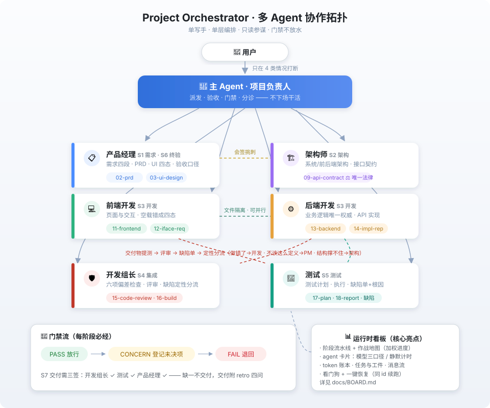
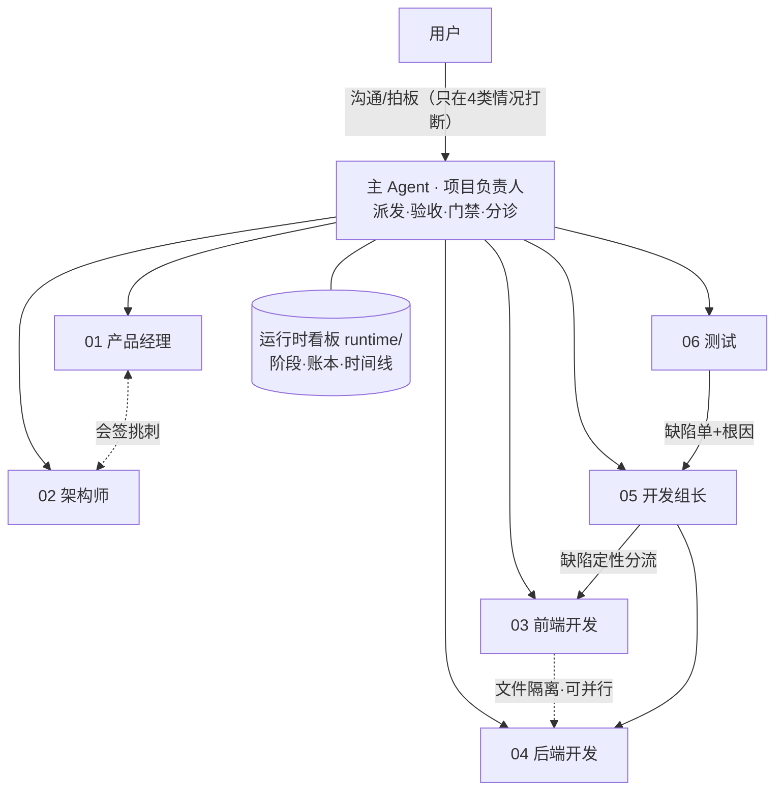
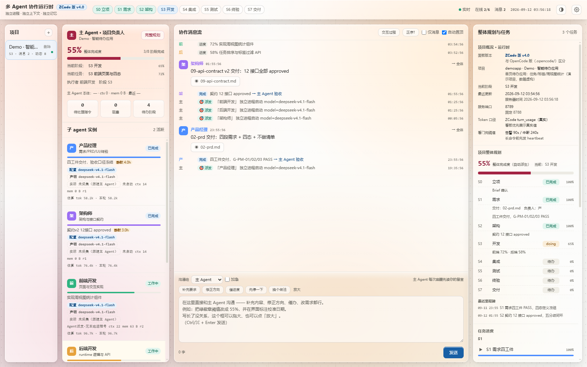
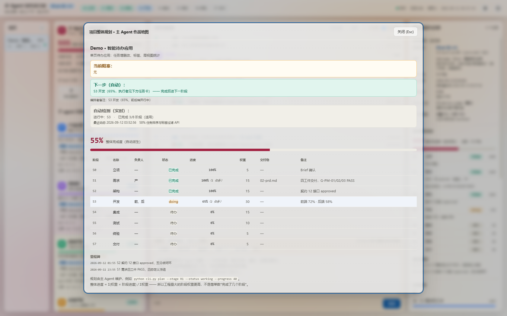

# Project Orchestrator Skill · 多 Agent 协作编排模式

**一句话**：把一个 LLM 主 Agent 变成"项目负责人"，指挥 6 个单责角色子 Agent（产品经理/架构师/前端/后端/开发组长/测试）按 S0–S7 阶段流水线交付完整产品——单写手、单层编排、只读参谋、门禁不放水。

**One-liner (EN)**: Turn one LLM agent into a project owner that orchestrates 6 single-accountability role sub-agents (PM / Architect / Frontend / Backend / Dev Lead / QA) through an S0–S7 stage pipeline — single writer, one-layer orchestration, read-only advisors, no gate-keeping shortcuts.

> 🇬🇧 English version: [README.en.md](README.en.md)

[]() []() []()

---

## 这是什么 / What is this

一套装在编码 Agent（ZCode，OpenCode 系）里的 **skill + 角色契约**。加载后，主 Agent 不再自己埋头写代码，而是像项目负责人一样工作：

- **不下场干活**：写代码、写文档、做决策全部派发给 6 个角色子 Agent，主 Agent 只做派发、验收、门禁和对外沟通；
- **流程强制**：S0 立项 → S1 需求 → S2 架构（接口契约=前后端唯一法律）→ S3 开发（前后端并行）→ S4 集成 → S5 测试 → S6 终验 → S7 交付（三签才交付）；
- **门禁不放水**：每个阶段有 PASS/CONCERN/FAIL 判定，CONCERN 必须登记未决项；
- **看得见**：自带运行时看板（浏览器实时视图：阶段进度、agent 卡片、token 账本、缺陷分流、时间线）。

## 架构一图流 / Architecture at a glance





阶段流水线：


仓库同时包含本轮迭代的两个进阶设计（含实验数据验证）：

1. **星形参谋（Advisor pattern）**：主角色唯一写笔 + 只读参谋一轮挑刺——实测把 PRD 盲评分从 21 提到 22.5、端到端产品质量 +13%；
2. **动态编制（Triage L0–L2）**：派发前按"工作量 × 可分解性"分诊，简单任务单角色，复杂任务才开参谋组——防止把多智能体的 15× token 成本烧在简单任务上。

## 仓库结构 / Repo layout

```
├── SKILL.md            # skill 本体（安装到 ~/.zcode/skills/project-orchestrator/）
├── agents/             # 6 个角色契约（安装到 ~/.zcode/agents/）
│   ├── product-manager.md   # 01 产品经理：需求四段/PRD/UI四态/终验
│   ├── architect.md         # 02 架构师：技术架构 + 09-api-contract（前后端唯一法律）
│   ├── frontend-dev.md      # 03 前端：造壳不造假，四态落地
│   ├── backend-dev.md       # 04 后端：业务逻辑唯一权威
│   ├── dev-lead.md          # 05 开发组长：评审/缺陷定性分流/可启动构建
│   └── qa.md                # 06 测试：想办法让它露馅
├── docs/
│   ├── BOARD.md          # 可视化看板介绍（截图+运行原理）
│   ├── USAGE.md          # 详细使用介绍（安装/唤醒/派发/看板/验收）
│   ├── ARCHITECTURE.md   # 架构构成与原理（角色/阶段/工件/运行时）
│   ├── DESIGN.md         # 设计决策与依据（含 2025-2026 研究引用）
│   ├── EVIDENCE.md       # 实验数据：探针、demo、三条件对照实验
│   ├── SECURITY.md       # 数据隔离与隐私声明
│   ├── CREDITS.md        # 引用的开源 skill 与研究致谢
│   ├── ROADMAP.md        # 路线图：OpenCode 版、通用版
│   └── assets/           # 架构图与看板截图
├── install.sh / install.ps1
├── DESCRIPTION.md        # GitHub 仓库描述（中英，可直接粘贴）
└── LICENSE
```

## 快速开始 / Quick start

```bash
# 1. 安装（ZCode）
bash install.sh
# Windows PowerShell: .\install.ps1

# 2. 在 ZCode 会话里说任意一句唤醒语：
#    「启动主 Agent」/「接管项目」/「按 ORCHESTRATOR 继续」/「多 agent 协作开发」
# 3. 主 Agent 会走唤醒流程：读 ORCHESTRATOR.md → 起看板 → 向你汇报四件事
#    （当前阶段/谁在跑/下一步/需要你拍板什么）
# 4. 填 docs/PROJECT_BRIEF.md（产品输入书），然后放手让它跑
```

详细用法（含派发命令模板、并行预算、看板排障、验收流程）：**[docs/USAGE.md](docs/USAGE.md)**

## 核心设计约束（违反即整套流程失效）

1. 主 Agent **不下场干活**——你一动手就没人验收了；
2. **不并行派发会写同一文件的 agent**——前后端可并行（文件隔离），PM×架构师会签必须串行；
3. **门禁不放水**——CONCERN 登记未决项，不用"差不多"换进度；
4. 每个子 agent 只看它该看的文件；
5. 只在四种情况打断用户——其余一律自行推进。

## 可视化看板：随项目实时生长的作战室

这是本框架最核心的亮点之一——不需要翻文件，浏览器里直接看六个角色怎么协作：



- **指挥台**：主 Agent 仪表盘（阶段/完成度/待处理指令），一键打开「完整规划」作战地图；
- **子 agent 卡片**：状态、进度、模型三口径、静默计时，中断可一键恢复（同 id 续跑保留记忆）；
- **协作消息流**：交付/进度实时置顶，工件点击即看（图片直接渲染）；
- **Token 账本**：按角色的消耗条形图，真实值优先读会话日志；
- **作战地图**：加权整体完成度、逐阶段负责人/权重/交付物、里程碑。



完整介绍与运行原理：**[docs/BOARD.md](docs/BOARD.md)**（截图为虚构演示数据）。

## 效果数据（摘要）

对照实验（同题 PRD，三条件 × 2 遍，独立评审盲评，30 分制）：

| 条件 | tokens/遍 | 得分 | 结论 |
|---|---|---|---|
| 单角色基线 | 21k | 21.0 | 简单任务的最优解 |
| 仅点名 skill | 32k | 17.25 | **负收益**（模板挤出实质内容） |
| 本框架（参谋+返修） | 122k | **22.5** | 增益集中在指标口径与边界维度 |

端到端小产品对照：本框架流水线盲评 **35/40** vs 传统单角色串行 **31/40**（+13%，成本 2.2×）。

完整数据与方法：**[docs/EVIDENCE.md](docs/EVIDENCE.md)** · 设计依据与研究引用：**[docs/DESIGN.md](docs/DESIGN.md)**

## 适用与不适用

✅ 适合：完整功能/小产品交付、需要留下 PRD→契约→代码→测试全链路工件的项目、资金/口径敏感型需求
❌ 不适合：一行小修、纯探索性脚本、你只想要个补丁的场景（单角色直接干更快）

## 路线图

- [x] v4.0 ZCode 版（本仓库）
- [ ] OpenCode 版（运行时同源，契约模板共用）
- [ ] 通用版（平台无关的 skill 描述 + 适配层）

详见 [docs/ROADMAP.md](docs/ROADMAP.md)。

## License

MIT（见 [LICENSE](LICENSE)）。引用的第三方开源 skill 与研究见 [docs/CREDITS.md](docs/CREDITS.md)。

## 数据隔离与隐私 / Data isolation

本仓库经过泄漏审计（无路径/凭据/供应商/项目信息），审计范围与提交者规范见 [docs/SECURITY.md](docs/SECURITY.md)。发现泄漏请立即提 issue。
