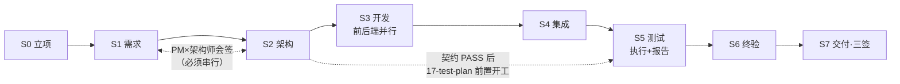
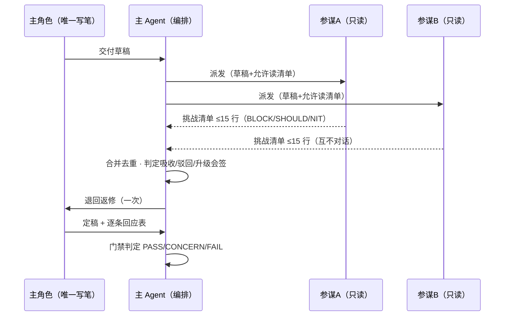

# 架构构成与原理 / ARCHITECTURE

> 中文正文 + English TL;DR per section.

## 1. 总览 / Overview

```
┌─────────────────────────────────────────────────────────┐
│                     用户（唯一需求来源）                    │
└──────────────────────────┬──────────────────────────────┘
                           │ 沟通/拍板（只在4类情况打断）
┌──────────────────────────▼──────────────────────────────┐
│              主 Agent = 项目负责人（Orchestrator）          │
│   派发 · 验收 · 门禁 · 分诊 · 对外沟通 · 不下场干活          │
└───┬───────┬───────┬───────┬───────┬───────┬─────────────┘
    ▼       ▼       ▼       ▼       ▼       ▼
 产品经理  架构师  前端开发  后端开发  开发组长   测试
  (01)    (02)    (03)    (04)    (05)    (06)
    ↖ 会签 ↗       ↖ 文件隔离并行 ↗   ↖ 评审分流 ↗   ↖ 提测 ↗
┌─────────────────────────────────────────────────────────┐
│        运行时看板 runtime/（daemon + 看板 UI + 账本）        │
└─────────────────────────────────────────────────────────┘
```

> English TL;DR: the user talks only to the orchestrator (main agent), which dispatches to 6 role sub-agents arranged in a stage pipeline; a local runtime provides a live board, ledgers and a watchdog.

## 2. 角色契约 / Role contracts

每个角色是一个 markdown 契约（`agents/*.md`），ZCode 把它作为子 agent 的系统提示。契约 frontmatter 声明 `name/description/tools/model(可选)`，正文是 YAML 头（上游/下游/产出/原则）+ 工作方法论。关键设计：

- **tools 不含 Agent 工具** → 结构上禁止子 agent 再派孙 agent（单层编排的第一道锁）；
- 每个角色有明确的**产出编号**（01~19），工件是验收唯一对象；
- 每个角色有一条"人格锚"：PM 是"用户的翻译官"、QA 是"想办法让它露馅的人"、架构师产出的契约是"前后端唯一法律"。

## 3. 阶段状态机 / Stage machine

S0 立项 → S1 需求 → S2 架构 → S3 开发 → S4 集成 → S5 测试 → S6 终验 → S7 交付。每阶段门禁判 PASS / CONCERN / FAIL：



- **PASS** 才进下一阶段；
- **CONCERN** 放行但登记未决项（`.zcode/state/open-issues.md`）；
- **FAIL** 退回重做；
- **S7 三签**：dev-lead / qa / product-manager 三方签收缺一不交付。
- **S5 前置（v4.1）**：用例设计只依赖契约不依赖代码，S2 门禁 PASS 后 qa 即与 S3
  并行起草 `17-test-plan`（照常门禁）；S5 阶段只剩执行与 `18-test-report`。
  前提是并发预算仍 ≤3：qa 进场时 S3 前后端已占两席，正好满编；
  若 S3 期间还有外援在场，则 qa 推迟到任一席位空出。

**入口变更分诊（v4.1）**：S1–S7 服务新需求面；上线后的增量改动在入口按 C0（单点轻改）/ C1（小需求，仅契约变更时会签）/ C2（走全流程）三级分诊，C0/C1 不开阶段状态机、门禁降为单点复查（`C0 fast-pass` / `C1 delta-pass`）。完整判据与增量纪律见 SKILL.md「变更分诊」。快车道的代价是契约漂移风险在集成期才暴露，所以判不准按 C1 走（会签便宜，漂移贵）。

阶段真相源是 `runtime/projects/<pid>/plan.json`；`gate-log.md` 与 `open-issues.md` 是手写真相源；`board.md` 是派生文件（`board_sync.py` 生成，勿手改）。

## 3.5 参谋会运行回路 / Advisor round（v1.2）

需要多视角时的标准回路：主角色唯一写笔，参谋只读挑刺一轮，门禁照常。



纪律：参谋**不写工件、不担门禁**；横向一致性由主角色收敛；参谋意见与契约冲突时**契约赢**（改契约走会签）。实测吸收率 81%（EVIDENCE.md §2）。

## 4. 编排原则（为什么这样设计）/ Orchestration principles

1. **单写手（single writer）**：每个工件只有一个可问责角色落笔。多人合写同一工件必然产生"隐含决策冲突"（Cognition），是脆弱系统的根源。
2. **单层编排（one layer）**：子 agent 的 tools 里没有 Agent 工具，结构上堵死嵌套。层级中继每一层都丢上下文、费 token（LangChain 基准：supervisor 输给 swarm 的原因）。
3. **只读参谋（read-only advisors）**：需要多视角时，主角色保持唯一写笔，只读参谋对草稿做**一轮**并行挑刺（≤3 个、≤15 行挑战清单、互不对话），主笔吸收后返修一次。实测吸收率 81%，且这是 2026 年业界收敛的 generator–verifier 形态（Cognition）。
4. **动态编制（triage L0–L2）**：派发前按工作量×可分解性分诊。**复杂 ≠ 可拆**：顺序耦合的工件（架构契约）加人有害（Google 研究：顺序任务多智能体全线 −39~70%）；可分解且机器可验证的工件（用例穷举、多页面）才加人。
5. **门禁不放水**：CONCERN 必须留痕；把需求缺陷当开发 bug 派发是流程里最贵的浪费，所以定性权只归开发组长。
6. **关键路径重叠，护栏不重叠（v4.1）**：依赖提前解除的工件（17-test-plan 只依赖契约）前置并行，省的是墙上时钟；依赖没解除的（会签、终验签字）绝不并行，省的只是返工。
7. **流程开销要配得上改动大小（v4.1）**：阶段状态机是为「新需求面」设计的；对单点轻改跑全流程，门禁的固定开销反而超过质量收益。入口变更分诊（C0/C1/C2）让小改动按比例付费——但增量模式只裁流程步数，不裁门禁判定与留痕。

> English TL;DR: five principles — single writer per artifact; one orchestration layer (no nested agents); read-only advisors challenging drafts for one round; triage-based dynamic staffing (complex ≠ decomposable — never parallelize sequential coupled work); and gates that log concerns instead of waving things through.

## 5. 运行时 / Runtime components

| 组件 | 职责 |
|---|---|
| `server.py` | 看板 HTTP 服务（ThreadingHTTPServer，Windows 独占绑定防双实例） |
| `daemon.py` | 脱离终端拉起 server，写 `.server.pid` / `.port`，支持 stop |
| `lib/store.py` | 状态存储：state/tasks/plan/registry/消息总线/记忆，全文件化、带全局锁 |
| `lib/usage.py` | token 账本：优先读 ZCode 会话库（turn_usage 真实值），无映射回退估算 |
| `cli.py` | 子 agent 上报命令行：spawn/progress/heartbeat/say/task/finish/model-report |
| `board_sync.py` | 从运行时真值重新生成 `board.md` |
| `ui/index.html` | 看板前端（无框架单文件） |
| 看门狗 | 每 15s 体检：静默 >240s 或进程消失判"中断"；优先读客户端 DB 判"活着/结束"，误判可撤销。子 agent 长 thinking 期靠定期 heartbeat 自证存活（v4.1），避免误判引发的取证/重派开销 |

数据文件（均在 `runtime/projects/<pid>/`）：`state.json`（agent 状态与 phase）、`tasks.json`（任务登记）、`plan.json`（阶段规划）、`registry.json`（角色账本与模型降级链）、`ledger.jsonl`（token 账本）、`bus/*.jsonl`（消息与事件总线）。

## 6. 模型路由 / Model routing（实测踩坑记录）

- 子 agent 默认继承主会话模型；
- 契约 frontmatter `model:` 支持按角色钉模型，**但必须是 `providerId/modelId` 限定格式**：客户端 `parseModelRef` 对不带 `/` 的平 id 一律解析到默认 glm 供应商，找不到就**静默回落**主模型——表现为"配置了不生效"；
- 角色清单与会话启动时加载：**会话中途增改契约不生效**，必须重启会话；
- 是否生效以计费库（`model_usage` 表）为准，看板"声明"只是派发时的自报。

## 7. 增进设计（v1.2 附录）/ Advanced: advisor & triage

星形参谋与动态编制的完整协议（参谋会运行回路、六团队编成、L0–L2 触发条件、反模式清单、等预算对照方法论）见仓库 `docs/DESIGN.md` §5–§6 与实验报告 `docs/EVIDENCE.md`。
