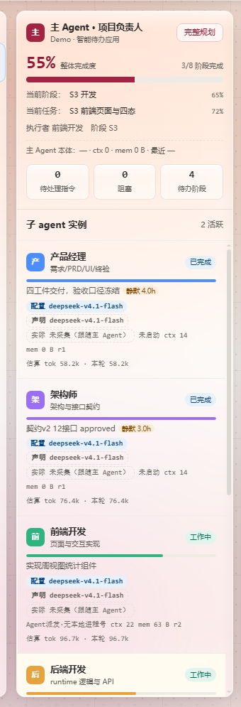
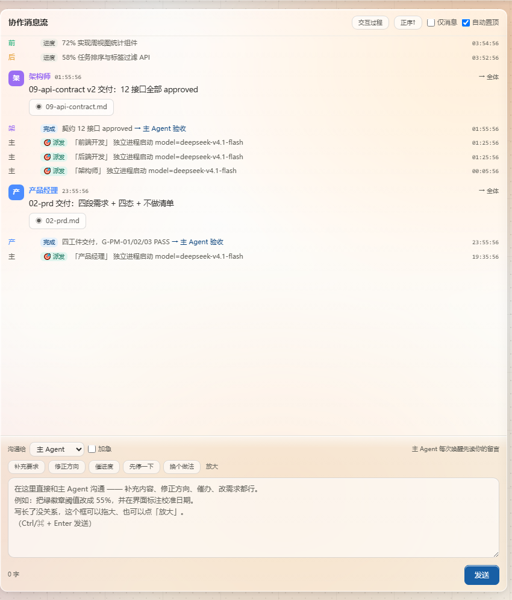
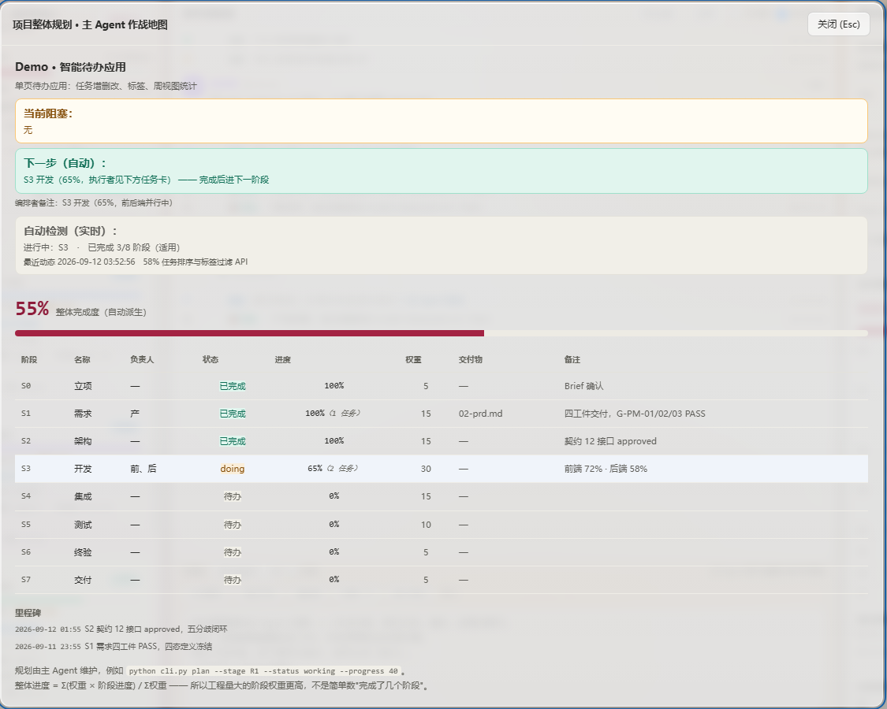
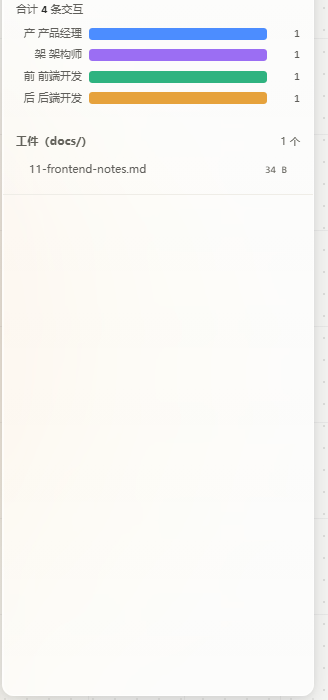
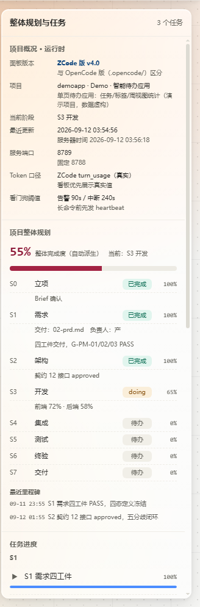
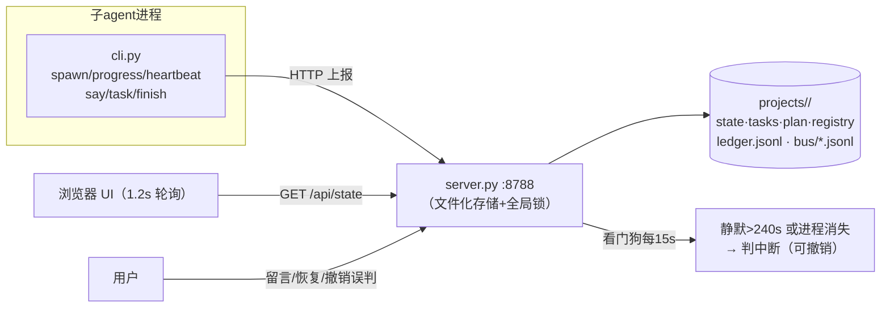

# 可视化看板 / BOARD

> 这是本框架最"肉眼可见"的部分：一个随项目实时生长的作战室。主 Agent 在上面指挥，六个角色在上面干活，你在外面看得一清二楚。中文正文，节末 English TL;DR。
> **以下截图全部来自虚构演示项目**「Demo · 智能待办应用」，名称/数字/端口均为演示用，不含任何真实数据。

## 全景 / Full view


三栏布局：左=指挥台与子 agent 实例，中=协作消息流与留言通道，右=项目概要、整体规划、任务进度、Token 账本、工件。顶部是 S0–S7 阶段流水线与实时状态。1.2 秒轮询，所有卡片自动刷新。

## 1. 阶段流水线 / Stage pipeline


- 每个阶段一枚芯片：**绿=已完成，蓝=当前阶段，灰=待办**；
- 高亮从 `plan.json` 真值**自动派生**——主 Agent 忘了上报阶段切换，看板也算得对（这是实测修出来的行为，见 DESIGN.md §模型路由同款的"诚实显示"哲学）；
- 阶段名右侧即整体完成度；点击「完整规划」进入作战地图（见 §4）。

## 2. 指挥台 + 子 agent 实例 / Command deck & agent cards



**指挥台（主 Agent 卡）**：当前阶段与整体完成度（加权自动派生）、当前任务与执行者、三个计数器（待处理指令 / 阻塞 / 待办阶段）、主 Agent 本体状态行。右上角「完整规划」一键打开作战地图。

**子 agent 卡片，每角色一张**，从上到下：

| 元素 | 含义 |
|---|---|
| 状态徽标 | 已完成（绿）/ 工作中（蓝绿）/ 空闲 / 待办 / **疑似停滞**（琥珀，看门狗判定）/ **进程消失**（红） |
| 进度条 + 当前步骤 | 子 agent `progress` 上报的百分比与一句话步骤 |
| 模型三口径 | `配置`（registry 账本·应然）· `声明`（派发自报）· `实际`（会话日志硬证据）；配置与实际不一致时挂琥珀 ⚠ |
| 静默计时 | 超过告警阈值（默认 120s）显示琥珀"静默 Xs"——长命令忘发 heartbeat 就会现形 |
| Agent代发/未本地进程 | 该 agent 是会话内派发还是独立进程 |
| ctx / mem / r2 | 上下文消息数 / 私有记忆字节 / 续跑轮次 |
| 任务 tok | 真实 token 消耗（累计 / 本轮），来自会话日志或账本估算 |
| 中断横幅 | 中断原因 + 停在哪 + **「恢复此 agent」按钮**（同 id 续跑，保留私有记忆与收件箱）+ 累计恢复次数 |

点击卡片可过滤时间线，只看该角色的动作。

## 3. 协作消息流 + 留言通道 / Stream & notes



- 所有角色的**交付与进度自动置顶聚合**（自动置顶开关可关），时间倒序，1.2s 轮询刷新；
- 消息可携带**工件按钮**：点击打开查看器——文本按行预览（可加载全文），图片直接渲染，登记路径失效时自动按文件名重定位；
- 「交互链接 / 压缩 / 仅消息 / 自动置顶」四个显示开关；
- 底部是**用户 → 主 Agent 留言通道**：快捷短语一键填入（补充内容 / 修正方向 / 催一下 / 先停一下 / 换个做法 / 放大），Ctrl+⏎ 发送。主 Agent 每次跑完读你的留言——这是你介入流程的日常入口，只有四类重大情况它才会主动打断你。

> English TL;DR: the stream aggregates every delivery and progress ping; artifact buttons open an inline viewer (text/image, with auto-relocation for stale paths); the bottom box is your channel to nudge or redirect the orchestrator with one-click quick phrases.

## 4. 作战地图 / Battle map

「完整规划」按钮打开，是主 Agent 交出的**逐阶段作战地图**：



- **当前阻塞（琥珀）/ 下一步·自动（绿）/ 编排者备注**：三行看完项目现状；
- **自动检测（实时）**：进行中阶段、已完成 X/8、最近动态——由运行时从真实状态推算，不靠手工维护；
- **整体完成度**：Σ(权重×阶段进度)/Σ权重 加权计算——工程量大的阶段权重高，不是"数完成了几个阶段"；
- **逐阶段表格**：负责人 / 状态 / 进度 / 权重 / 交付物 / 备注，一行一阶段；
- **里程碑**：自动记录关键节点。

## 5. Token 账本 + 轮次统计 / Token ledger



- 按角色条形图，**真实值优先**（读 ZCode 会话日志，tooltip 含输入/缓存读/缓存写/输出/请求次数/耗时明细），无会话映射回退账本估算并标注「估算」；
- retro 四问之一"token 大头在哪个角色/阶段"直接看图回答；
- 下方**轮次统计**：每个角色的派发轮次条形图；
- **工件面板**：扫描 `docs/` 全目录，点击即看。

## 6. 右栏速览 / Right rail



项目概要（面板版本/端口/Token 口径/看门狗阈值）、整体规划缩略（55% 进度条 + 逐阶段状态 + 里程碑）、任务进度树（按阶段分组，进度条直读）。多项目时右上角切换。

## 7. 运行原理 / How it works



- **数据全文件化**：没有数据库——状态就是 JSON/JSONL 文件，可直接 git 管理；
- **看门狗双保险**：server 后台线程每 15s 体检（不依赖页面打开）；"在深思"与"已挂死"不可区分时只报"疑似停滞"，绝不断言；
- **多项目**：一项目一目录（`runtime/projects/<pid>/`），右上角切换；
- **诚实显示原则**：阶段自动派生、任务自动派生、模型三口径分离——宁可显示"未采集（跟随主 Agent）"也不显示假数据。

## 8. 打开方式 / Open the board

```bash
python runtime/daemon.py 8788      # 起服务（脱离终端，已在跑则跳过）
python runtime/board.py open       # 自动打开浏览器
# 排障：curl http://127.0.0.1:8788/api/state（Git Bash 加 --noproxy '*'）
```

**不要**双击 `ui/index.html` 本地打开——`file://` 下没有后端，页面永远是死的。

## 9. 演示数据声明 / Demo data notice

本文截图由脚本伪造的演示项目生成（沙箱见仓库外 `board-demo/`），任务、进度、token 数均为虚构，不包含任何真实用户数据。
