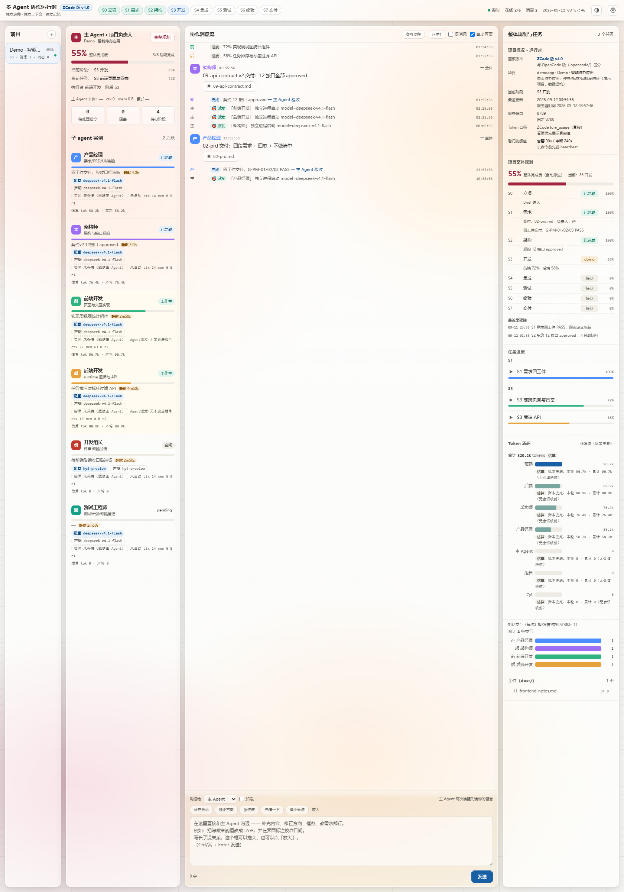

# 可视化看板 / BOARD

> 这是本框架最"肉眼可见"的部分：一个随项目实时生长的作战室。中文正文，节末 English TL;DR。
> 以下截图来自**演示项目（全部数据为虚构）**，端口/名称/数字均为演示用。


## 1. 六大亮点 / Highlights

### ① 指挥台（主 Agent 卡片）
当前阶段、整体完成度、当前任务、待处理指令/阻塞/待办阶段三个计数器——主 Agent 的"仪表盘"。右上角「完整规划」一键打开作战地图。

### ② 阶段流水线 + 作战地图
顶部 S0–S7 阶段条：绿=已完成、蓝=进行中、灰=待办（自动从 plan 真值派生，主 Agent 忘了上报也能显示对）。「完整规划」弹窗（下图）是主 Agent 交出的作战地图：加权整体完成度、逐阶段状态/负责人/权重/交付物、自动检测实时状态、里程碑时间线、下一步（自动）。


### ③ 子 agent 实例卡片
每个角色一张卡：状态徽标（已完成/工作中/空闲/疑似停滞/进程消失）、进度条、当前步骤、**模型三口径**（配置=账本应然 · 声明=派发自报 · 实际=会话日志硬证据，不一致会挂琥珀 ⚠）、静默计时（超阈值变琥珀，提示"可能卡住"）、私有权（mem/轮次）。中断的卡片带**一键恢复**按钮（同 id 续跑，保留记忆与收件箱）。

### ④ 协作消息流 + 时间线
所有 agent 的交付、进度、say 自动置顶聚合；每条消息可带工件按钮（点击直接查看内容，图片按图渲染、路径失效自动重定位）。底部是**用户→主 Agent 留言通道**：补充内容/修正方向/催进度/先停一下，一键快捷短语。

### ⑤ Token 账本（角色条形图）
按角色聚合的 token 消耗条形图：真实值优先（读 ZCode 会话日志，含缓存命中明细 tooltip），无会话映射回退账本估算并标注。retro 四问之一"token 大头在哪个角色"直接看图回答。



### ⑥ 任务进度 + 工件面板
按阶段分组的任务卡（进度/执行者/交付工件）；工件扫描 `docs/` 全目录，点击即看。**数据兜底**：主 Agent 忘了登记任务时，面板从各 agent 当前任务指针自动派生，永不空白。

> English TL;DR: a live "war room" — command deck for the orchestrator, S0–S7 stage map with weighted progress, per-agent cards (status/model chips/silence timers/one-click resume), collaboration stream with inline artifact viewer, per-role token bars (real usage from session logs), and auto-derived task & artifact panels. Demo screenshots above use fabricated data.

## 2. 运行原理 / How it works


- **数据全文件化**：没有任何数据库，状态就是 JSON/JSONL 文件——可直接 git 管理、可直接手改（真相源分工见 ARCHITECTURE §3）；
- **1.2 秒轮询**：前端拉 `/api/state` 快照，按签名去重渲染；
- **看门狗双保险**：server 后台线程每 15s 体检（不依赖页面打开）；存活判定优先读客户端会话库（"在深思"与"已挂死"不可区分时只报"疑似停滞"，不断言）；
- **多项目**：`runtime/projects/<pid>/` 一项目一目录，看板右上角切换。

## 3. 打开方式 / Open the board

```bash
python runtime/daemon.py 8788      # 起服务（脱离终端）
python runtime/board.py open       # 自动打开浏览器
# 排障：先 curl http://127.0.0.1:8788/api/state（Git Bash 加 --noproxy '*'）
```

**不要**双击 `ui/index.html` 本地打开——`file://` 下没有后端，页面永远是死的。

## 4. 演示数据声明 / Demo data notice

本文截图由脚本伪造的演示项目「Demo · 智能待办应用」生成（见仓库外 `board-demo/` 沙箱），任务、进度、token 数均为虚构，不包含任何真实用户数据。
