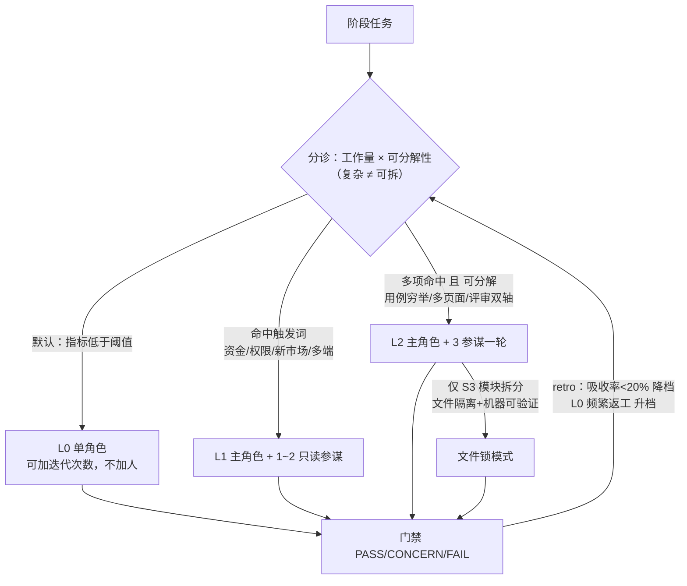

# 设计决策与依据 / DESIGN

> 每条设计决策都标注了它的依据：外部研究（带链接）或本仓库实测（链接到 EVIDENCE.md）。中文正文，节末 English TL;DR。

## 1. 为什么是"6 个单责角色"而不是"6 个角色团队"

**依据**：Anthropic《How we built our multi-agent research system》——多智能体消耗 ~15× tokens，编码任务真正可并行的部分远少于研究；LangChain 多智能体基准——supervisor 的中继层丢上下文且更贵；MAST 失败分类——"agent 间错位"（隐瞒信息/忽略他人输入/任务跑偏）是核心失败类别，字面模仿 SDLC 的角色扮演框架（ChatDev/MetaGPT 系）实测失败率 41–86.7%。

**结论**：6 个单责角色 + 门禁，而不是每个角色扩成合写团队。团队化只在"主笔唯一 + 参谋只读"的形态下引入（见 §5）。

> English TL;DR: single-accountability roles beat co-writer teams because parallel writers exchange implicit decisions they can't see; the 2025–26 literature and SDLC-role-play failure rates support one writer per artifact.

## 2. 为什么单层编排、禁止嵌套

**依据**：LangChain《Benchmarking multi-agent architectures》——supervisor 的转述层是主要损失点，修复交接后 +50%；每层中继 = 一次上下文转述 = 一次决策衰减。

**实现**：角色契约 frontmatter 的 `tools` 不含 Agent 工具——结构上堵死，不靠提示词自觉。

## 3. 为什么 PM×架构师会签、三签交付

**依据**：MAST 的"任务验证"类失败（过早终止/验证薄弱）；框架实测中会签拦下的最高频问题是"需求缺陷被当成开发 bug"——缺陷定性分流表因此只归开发组长。

## 4. 为什么"读可以并行，写/合并不行"

**依据**：LangChain 方法论文章；Cognition《Don't Build Multi-Agents》的 Flappy Bird 案例（两个并行写手各画各的，合并即冲突）。因此 S3 允许前后端并行（文件天然隔离），同一工件的写作权永不并行。

## 5. 星形参谋（2026 收敛形态）/ Star advisors

**依据**：Cognition 2026-04《Multi-Agents: What's Actually Working》承认生产中真正有效的是**零共享上下文的干净评审 agent**（generator–verifier，~2 缺陷/PR、58% 严重级）；Anthropic Agent Teams（2026-02）的口径也是单写手 + 只读验证者 + 禁止嵌套。

**协议**：草稿 → 主 Agent 派 2–3 个只读参谋并行挑刺 → 合并去重 → 主笔一次返修 → 门禁照常。参谋不写工件、不担门禁、互不对话；挑战与契约冲突时**契约赢**（改契约走会签）。

**反向修正**：Dochkina 25,000 次实验（arXiv:2603.28990）证明预指派职级人设是负资产（自组织 +14%），因此参谋 prompt 只给"视角 + 挑战格式"，不写死"首席/总监"剧本。

## 6. 动态编制（分诊 L0–L2）/ Dynamic staffing

**依据**：Google《Towards a Science of Scaling Agent Systems》（arXiv:2512.08296，180 配置）——顺序任务上多智能体全线 −39~70%，中心化编排只在可并行任务 +80.9%，且有预测模型能在 87% 未见任务上选对架构；等预算研究（arXiv:2604.02460）——多智能体表观收益多为未记账算力。

**协议**：评估维度是两个——工作量 与 **可分解性**（能否切成互不抢决策的块）。拿不准就降档（高估的代价确定、低估被门禁拦截）；阈值靠 retro 回调。

## 7. 模型路由（实测坑）/ Model routing

**实测结论**（详见 EVIDENCE.md §5）：
- 契约 frontmatter `model:` 必须 `providerId/modelId` 限定——平 id 被客户端 `parseModelRef` 归入默认 glm 供应商，找不到即**静默回落**主模型（本仓库探针实测复现）；
- 角色清单会话启动时加载，**会话中途改契约不生效**；
- 是否生效以计费库 `model_usage.model_id` 为准，"声明"字段只是派发自报。

## 8. 已知取舍与未解问题

- 对照实验 n=2，方向一致但无统计学意义，推广前应做 n≥5 + 双评审（EVIDENCE §3）；
-参谋组只在高价值任务开：+13% 质量对应 2.2× 成本（EVIDENCE §2）；
- 工件变多后"契约精度向代码传导"会衰减（B2 出现 parseInt 类接缝 bug），故前端完工后加"契约↔代码逐条对齐"抽查门禁。

## 主要外部参考

| 来源 | 关键数字 |
|---|---|
| [Anthropic · multi-agent research system](https://www.anthropic.com/engineering/multi-agent-research-system) | 15× tokens；+90.2% 研究评测；编码并行度低 |
| [Anthropic · Agent Teams](https://code.claude.com/docs/en/agent-teams)（2026-02） | 3–5 teammates；禁嵌套；顺序/同文件工作回单会话 |
| [Cognition · Don't Build Multi-Agents](https://cognition.com/blog/dont-build-multi-agents) | 隐含决策冲突；单线程线性 agent |
| [Cognition · What's Actually Working](https://cognition.com/blog/multi-agents-working)（2026-04） | 零共享上下文评审 ~2 bug/PR；反对并行写手 |
| [LangChain · Benchmarking](https://www.langchain.com/blog/benchmarking-multi-agent-architectures) | swarm>supervisor；中继层是损失点 |
| [Google · Scaling Agent Systems](https://arxiv.org/abs/2512.08296) | 顺序任务多智能体 −39~70%；可并行 +80.9%；87% 选对架构 |
| [Dochkina · Drop the Hierarchy](https://arxiv.org/abs/2603.28990) | 自组织胜预指派角色 +14%；涌现层级 ≤2 |
| [等预算研究](https://arxiv.org/abs/2604.02460) | 同预算下单 agent 不输多智能体 |
| [MAST 失败分类](https://arxiv.org/abs/2503.13657) | 14 失败模式；SDLC 角色扮演框架失败率 41–86.7% |
| [AgentPrune](https://arxiv.org/abs/2410.02506) | 通信冗余 28–73% 可裁剪 |
