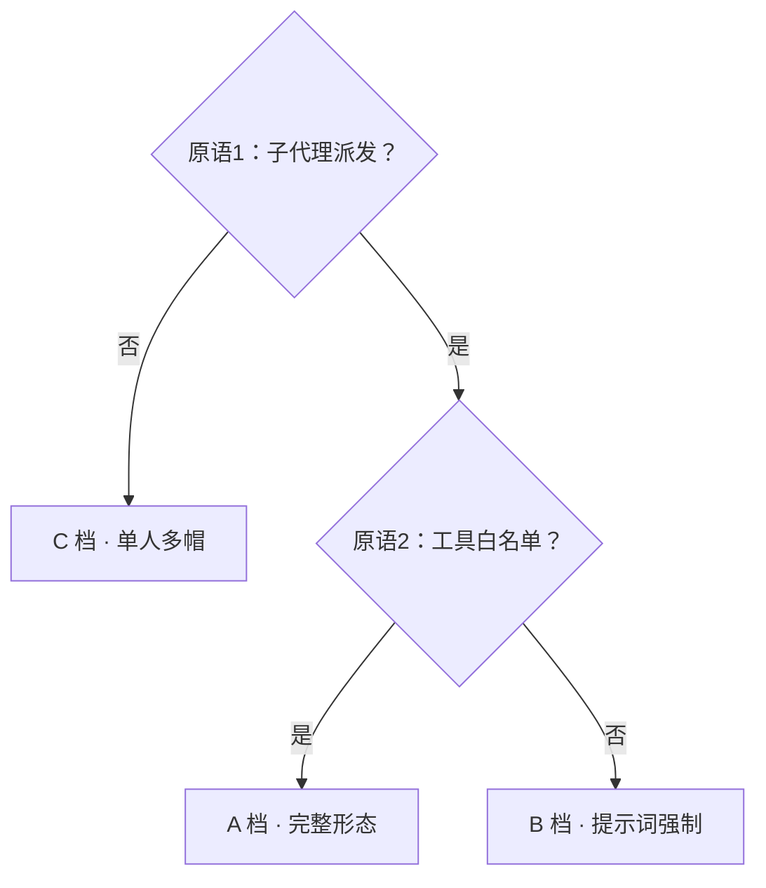

# PORTING · 移植指南（把通用版协议移植到你的 agent 工具）

> 通用版 = 协议（SKILL.md + 契约 + 协议文件）+ 一个待填的 `platform-config.md`。
> 本指南带你完成移植：盘点平台能力 → 定档 → 填配置 → 落地验证。
> 全程约 30–60 分钟；有子代理派发能力的工具可让 agent 自己完成（见 §五 自举提示词）。

## 一、原语映射表（阶段 0：盘点）

协议依赖 8 项平台原语。逐项盘点你的工具，填进 `platform-config.md`：

| # | 原语 | 协议用途 | 盘点问题 | 不支持时的降级 |
|---|---|---|---|---|
| 1 | 子代理派发 | 主 Agent 派 6 角色执行 | 能否在会话中启动独立上下文的子任务？ | C 档：单人多帽 |
| 2 | 子代理工具限制 | 结构性堵死嵌套派发 | 能否声明子代理**不可用**某些工具？ | B 档：提示词强制 + 验收抽查 |
| 3 | 文件读写 | 工件交接、契约、门禁留痕 | 子代理能否读写工作区文件？ | 不能则本框架不适用 |
| 4 | 长命令执行 | 构建/测试/起服务 | 子代理能否跑 shell/进程？ | C 档主代理代跑 |
| 5 | 异步上报 | 进度/心跳/收工信号 | 子代理执行中能否向外部写状态？ | 降级为验收时核对 |
| 6 | 定时巡检 | 看门狗 | 平台或 OS 层能否周期检查？ | 砍看门狗，靠文件活动人查 |
| 7 | 常驻服务 | 看板 UI | 能否起 HTTP 服务并让用户访问？ | 砍 UI，保留 markdown 看板 |
| 8 | 提示注入 | 契约作为子代理系统提示 | 派发时能否指定系统提示？ | 派发 prompt 头部贴契约全文 |

## 二、定档规则



- **A 档**：单层编排结构性堵死，看板/账本/看门狗全量可用；
- **B 档**：功能同 A，但一层编排靠派发 prompt 重申禁令 + 主 Agent 验收抽查
  （检查子代理产出里有没有「我另外派了…」的痕迹）。文档必须标注「B 档：编排隔离弱于 A」；
- **C 档**：单人多帽，独立验收损失，用「切帽自检 + 用户抽验」补偿。
  三档的铁律、门禁标准、工件编号、追溯留痕**完全一致**——降级只动实现，不动标准。

## 三、落地步骤

1. **拷贝**：把 `universal/` 整目录拷进你的资产目录；runtime 与主仓库共享
   （纯 Python 标准库，零第三方依赖），按 `platform-config.md` 的 board/reporting 决定装或不装；
2. **盘点**：按 §一 填 `platform-config.md`（8 项原语 + tier）；
3. **改路径**：契约正文出现的 `protocols/`、`state/`、`runtime/` 均为相对约定，
   按你工具的资产布局落地（建议统一在 `.orchestrator/` 前缀下，保持多工具共存时互不污染）；
4. **通读改造点**：各契约的「推荐 skill」清单按你平台实际可用的 skill 库替换——
   框架只依赖「派发时点名激活」机制，不依赖具体 skill（参考引用：pm-skills 集、
   Matt Pocock skill 集，见主仓库 docs/CREDITS.md）；
5. **验证**：跑一次最小流程（brief → 1 角色派发 → 1 工件 → 门禁判定 → gate-log 落盘）。

## 四、验证清单（移植完成的定义）

- [ ] `platform-config.md` 8 项原语 + tier 已填，无 `{{...}}` 残留
- [ ] 6 份契约能在派发时注入（A/B 档）或可被主 Agent 读取切帽（C 档）
- [ ] 最小流程跑通：PROJECT_BRIEF → 1 个角色产出 1 个工件 → gate-log 有判定行
- [ ] 门禁三档（PASS/CONCERN/FAIL）与留痕文件落盘正确
- [ ] 看板可用（A/B）或已明确降级为 markdown 看板（记录在哪一档）
- [ ] README 已向用户说明本移植的档位与降级项（不静默省略）

## 五、自举提示词（让 agent 替你完成移植）

> 把下面整段发给 {{TOOL_NAME}} 的会话即可。它先盘点自身能力，再按本指南执行。

```
请把通用版多 Agent 协作框架（project-orchestrator universal）移植到你自己的平台上。

对照源：https://github.com/kimi0hhhh/project-orchestrator-skill（tag v4.1，universal/ 目录）
你的工作目录：{{安装位置}}

按以下阶段执行，每阶段结束输出小结再继续：

阶段 0 · 能力盘点：对照 universal/PORTING.md §一 的 8 项原语映射表，逐项盘点你自己
（发起子代理、限制子代理工具、读写文件、跑长命令、异步上报、定时巡检、起常驻服务、
提示注入）的真实能力——填「实际支持什么」，不填「理论上能做什么」。

阶段 1 · 定档：按 PORTING.md §二 规则得出 A/B/C 档，说明判定依据。

阶段 2 · 填配置：完整填写 universal/platform-config.md（替换全部 {{...}} 占位符）。

阶段 3 · 落地：universal/SKILL.md、agents/ 六份契约、protocols/ 三份协议、
templates/PROJECT_BRIEF.md 拷贝/适配到你的资产布局（建议 .orchestrator/ 前缀）；
各契约「推荐 skill」替换为你平台实际可用的等价 skill；runtime 按档位决定装或降级。

阶段 4 · 验证：按 PORTING.md §四 清单逐项验证，跑一次最小流程（brief → 1 角色派发 →
1 工件 → 门禁判定 → gate-log 落盘）。

纪律：工具做不到的能力要「降级并标注」，禁止静默省略；不改协议判定标准来迁就工具；
最后输出移植回执：变更清单 + 降级清单 + 差异裁决记录。
```
